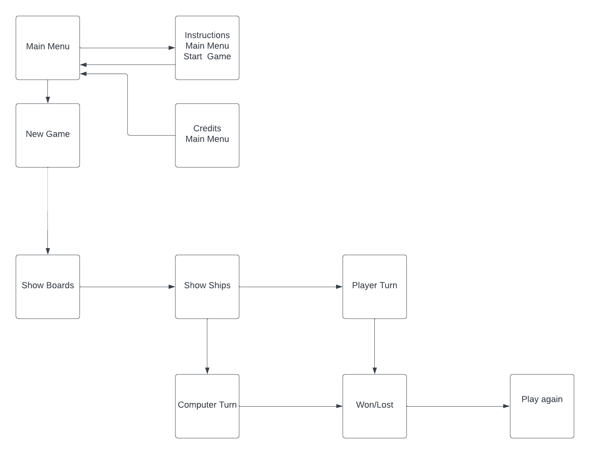
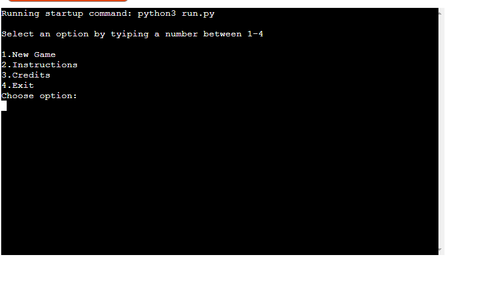
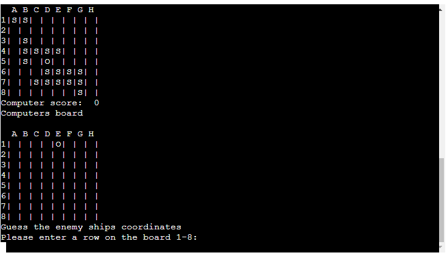
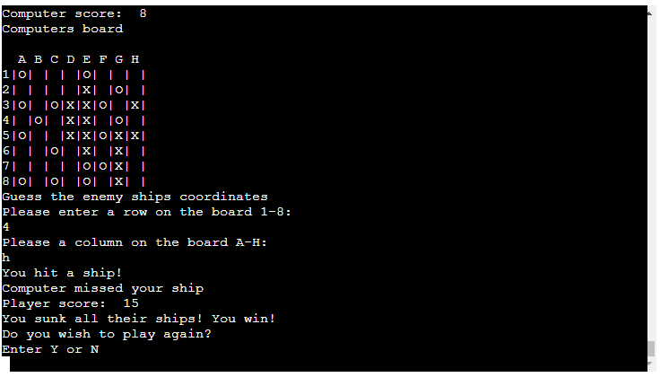
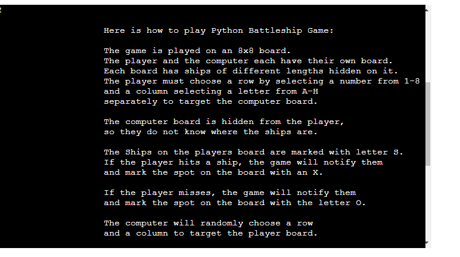
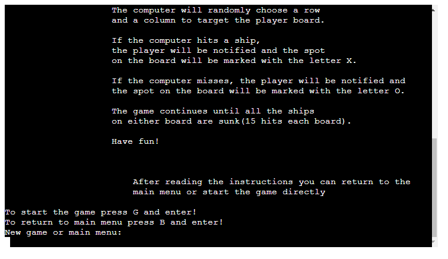
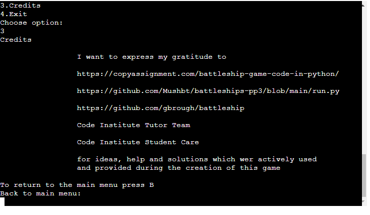

# Python Battleships Game

[Play Python Battleships Game](https://python-battleships-pp3.herokuapp.com)

## Table of Contents
---

- [UX](#ux)
    - [Website owners goals](#website-owners-goals)
    - [Users goals](#users-goals)
    - [Flowchart](#flowchart)
- [Features](#features)
    - [Game](#game)
    - [Features to implement in future](#features-to-implement-in-future)
- [Technologies used](#tecnologies-used)
- [Libraries used](#libraries-used)
- [Testing and Validation](#testing-and-validation)
    - [PEP8](#pep8)
    - [Manual testing](#manual-testing)
    - [User stories testing](#user-stories-testing)
    - [Bugs](#bugs)
    - [Unfixed Bugs](#unfixed-bugs)
- [Deployment](#deployment)
    - [Step by step deployment](#step-by-step-deployment)
- [Credits](#credits)

## UX

### Website owners goals 
- Create a simple game which will amuse and interest and user
- Describe how the game is played
- Offer the option to the user to play again

### Users goals
- Play a simple game against the computer
- Easy to play with simple and understandable commands
- The Board and score are always visible so that the user always knows the result

### Flowchart
The Chart which explains the logic of the game was created using Lucid.app

## Features

### Game
#### Instructions
The game is played on an 8x8 board.
The player and the computer each have their own board.
Each board has ships of different lengths hidden on it.
The player must choose a row by selecting a number from 1-8 and a column selecting a letter from A-H separately to target the computer board.
The computer board is hidden from the player, so they do not know where the ships are.
The Ships on the players board are marked with letter S.
If the player hits a ship, the game will notify them and mark the spot on the board with an X.
If the player misses, the game will notify them and mark the spot on the board with the letter O.
The computer will randomly choose a row and a column to target the player board.
If the computer hits a ship, the player will be notified and the spot on the board will be marked with the letter X.
If the computer misses, the player will be notified and the spot on the board will be marked with the letter O.
The game continues until all the ships on either board are sunk(18 hits each board).
1. Here is the main menu which is shown you open the website.

 [Top of the Page](#table-of-contents)

2. If you press 1 the game will start
- To play the game gues the row by typing anumber between 1-8
- After selecting the number, choose a column from A-H to target the cell

- To win the game, either the player or the computer needs to hit all of the enemy ships (score 18)

3. Here are the instructions to play the game
- After reading the instructions you can also start the game directly from here by choosing G or return to main menu by choosing B.

4. The credits are displayed when the user hits 3.
The user can hit B to return to main menu.

### Features to implement in future
 - Multiplayer mode where a player can player against another player.
 - The user can choose the level dificultie: hard, medium, easy
 - The user can login and keep track of number of games played and won/lost
## Technologies used
 - Heroku
 - Python
 - Gitpod
 - Github
## Libraries used
 - Python libraries: Random, System and String

 [Top of the Page](#table-of-contents)
## Testing and Validation

### PEP8
The code was checked with PEP8 validator and passed with no error found.
### Manual testing
All features have been tested manually on a laptop on different browsers (Chrome, Safari, Firefox).

### User stories testing
- As a user I can play a simple battleship game against the computer
- The gameplay is easy to understand and the command logic is simple.
- The Board and score are always visible so I can keep track of the result

### Fixed Bugs
- The computer board was visible to the player. This was fixed by extending the show board function to replace the "S" with an empty string.
- The ships were only positioned verticaly. This was fixed by changing the order of column and i in playe ship function

### Unfixed Bugs
- There are no unfixed bugs
## Deployment
 
### Step by step deployment
#### The following steps were taken to deploy the page to Heroku from its GitHub repository:

1. Log in to your Heroku account or register a new one.
2. Click the "New" button in the top right corner of the dashboard.
3. Select "Create new app" from the drop-down menu.
4. Choose a unique app name and region, then click "Create App."
5. Once the app is created, go to the "Settings" tab.
6. Scroll down to "Config Vars" and click "Reveal Config Vars."
7. Add a "KEY" field and enter "PORT" and a "value" field of "8000." Then click "Add."
8. Scroll down to "Buildpacks" and click "Add buildpack."
9. Select "Python" and then add "node.js" as another buildpack.
10. Make sure that Python is on top of the buildpacks. If not, click and drag it to the top and save.
11. Return to the "Deploy" tab and select "Github" as the deployment method.
12. Connect your GitHub account.
13. Search for your repository name and connect it.
14. Choose how you want to push updates from the following options:
- Click "Enable Automatic Deploys" to update the app automatically whenever you push updates to your GitHub repository.
- Select the correct branch for deployment from the drop-down menu and click "Deploy Branch" to update the app manually each time.
## Credits

- https://copyassignment.com/battleship-game-code-in-python/ 
- https://github.com/Mushbt/battleships-pp3/blob/main/run.py
- https://github.com/gbrough/battleship
- Code Institute Tutor Team
- Code Institute Student Care

 [Top of the Page](#table-of-contents)